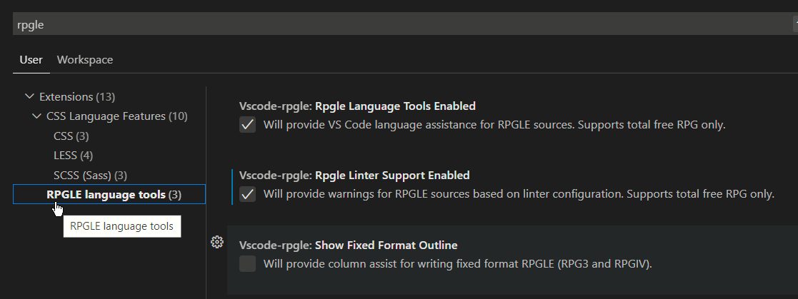
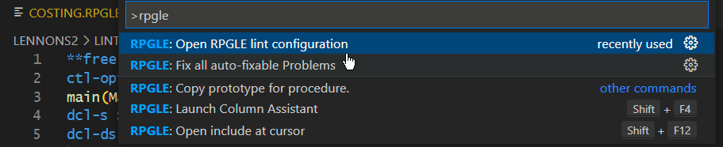
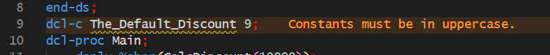
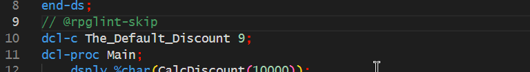
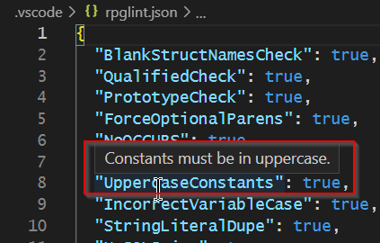
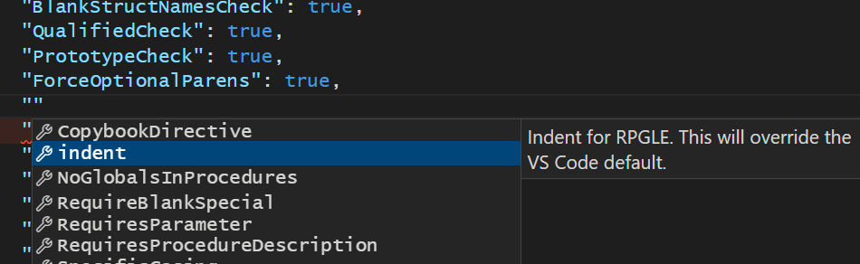
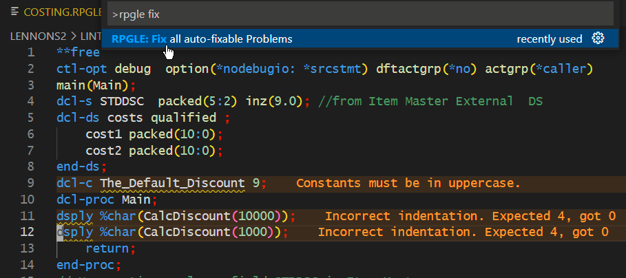
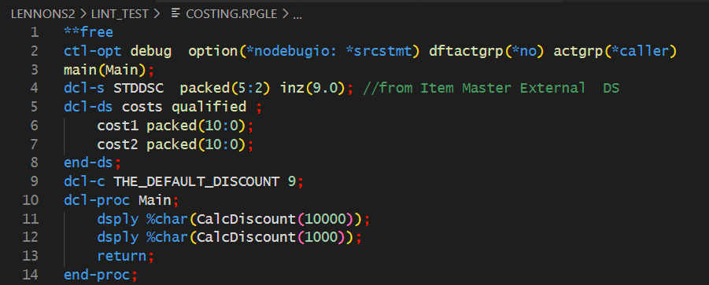

# vscode-rpgle README

Adds functionality to assist in writing accurate and consistent RPGLE, including:

* Content assist
* Outline view
* Linter, including indentation checking and reformatting (`**FREE` only) 
* Column assist for fixed-format RPGLE.

Depends on the Code for IBM i extension due to source code living on the remote system.

## FAQ

1. **Does this only work with free-format?** The content assist and outline view works for all ILE versions of RPG, including fixed-format. The column assist is for fixed-format only. The linter is for `**FREE` format only.
2. **My copybook is not opening or prototypes are not coming from my copybook.** Right now, it is an explicit path to your member or streamfile. For example, if you're editing `YOURLIB/QRPGLESRC/HELLOWORLD.rpgle` and your copybook path is `QRPGLEREF,PRTYPE`, then it will assume the library of `YOURLIB`. For streamfiles, it will be relative to your working directory. For local files, it will be your VS Code workspace.
3. **Does this work with local projects?** Yes! But, your local RPGLE must be the IFS style path on your `copy` and `include` directives.
4. **Why am I getting indentation errors?** When the linter is enabled in the settings, you will start to get errors based on the lint rules configuration. Indentation errors are based on the indentation setting from VS Code (or the assumed indentation from the current file).
## How to enable

Enable these options in VS Code settings.

* `vscode-rpgle.rpgleLanguageToolsEnabled` - enabled by default
   * Provides outline view, go to defintion and find references
* `vscode-rpgle.rpgleLinterSupportEnabled` - disabled by default. See Linter below for more on linting.
* `vscode-rpgle.showFixedFormatOutline` - column assist for RPGLE fixed-format.
   * `vscode-rpgle.rpgleColumnAssistant` - Shift+F4 to launch it when on fixed-format line.

# Linter

Linter support is a set of rules that help you write consistent and accurate code. You can turn a rule on or off to suit your standards, and you can disable linter rules on a single line.

The linter rules are held in a JSON document relative to the RPGLE source code that is being worked on.

## Rules Location

### Developing in a Library

If you are developing in `LIB/QRPGLESRC/MYSOURCE.RPGLE`, then the linter rules exist in `LIB/VSCODE/RPGLINT.JSON`. Each library has its own rules configuration file, binding it to all sources in that library. 

### Developing in the IFS

When developing in the IFS, linter rules exist in `.vscode/rpglint.json` in the current working directory.

### Opening the linter rules

Use `vscode-rpgle.openLintConfig` to open the rules configuration for the source you're working in.

Or you can right click on a library filter:

 If linter rules file  does not exist, you will be asked asked if you want to create one. The created file will provide some default rules, as below.

## Linter directives

### `// @rpglint-skip`

   The next line's indent and rule check will be skipped.

#### Example Before

#### Example After

## Linter Default Rules

   This is not an opionated linter, but When a new linter rules configuration file is created, these defaults that we consider useful are provided:

      "BlankStructNamesCheck": true,
      "QualifiedCheck": true,
      "PrototypeCheck": true,
      "ForceOptionalParens": true,
      "NoOCCURS": true,
      "NoSELECTAll": true,
      "UppercaseConstants": true,
      "IncorrectVariableCase": true,
      "StringLiteralDupe": true,
      "NoSQLJoins": true,
      "NoCTDATA": true,
      "PrettyComments": true,
      "NoGlobalSubroutines": true,
      "NoLocalSubroutines": true,
      "UppercaseDirectives": true

When a rule conflicts with your coding style it may be disabled by changing it to `false`. For example:

      "PrototypeCheck": false,

You can get more information about a lint option by hovering over it:

Note that you can use a **Linter Directive** (above) to disable checking on a single occurrence of a lint error or warning.

## Optional Linter Rules

Additional Linter rules can be added by enabling a new optional rule anywhere.  When you enter the `"` at the beginning of the new line you see the optional rules and the additional description, and you can select one:

### SpecificCasing

This rule allows you to specify the casing required for any or all declares or BIFs.

If you want all `DCL` to be lower case and all `BIF`s to be upper case, then it would be coded like this:

      "SpecificCasing":[
         {"operation": "*BIF","expected": "*upper"},
         {"operation": "*DECLARE", "expected": "*lower"}
      ]

If you wanted `%parms` and `%timestamp` to always be lower case, amd all other BIFs to be upper case, then it would be coded like this:

      "SpecificCasing": [
         {
            "operation": "%parms",
            "expected": "*lower"
         },
         {
            "operation": "%timestamp",
            "expected": "*lower"
         },
         {
            "operation": "*bif",
            "expected": "*upper"
         }
      ]
 Note: The order of entries above is important.

 Or, if for some reason, you wanted `%timestamp` to always be coded as `%TimeStamp` then it could be coded like this:

      "SpecificCasing": [
         {
            "operation": "%parms",
            "expected": "*lower"
         },
         {
            "operation": "%timestamp",
            "expected": "*TimeStamp"
         },
         {
            "operation": "*bif",
            "expected": "*upper"
         }
      ]

## Correcting Linter Errors Automatically

The linter can fix many errors that it highlights, including indentation.

Errors before:

Errors fixed:

After you have auto-fixed problems, some auto-fixable problem may still exist. Running another auto-fix pass may be needed.

**Note:**  Undo (Ctrl + Z, or Cmd + Z) undoes only a single auto-fixed line. If you are anticipating extensive changes, you may want to save your file first. 

## Developing

1. Fork & clone
2. `npm i`
3. Run
   * `npm run test`
   * Debug 'Run Extension'

